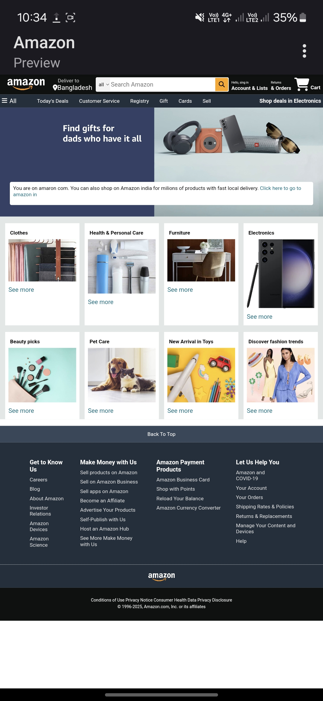

<h1>Amazon Clone</h1>

This is a amazon website clone maked with html and css.
<h2>General Information</h2>

<ul>
<li>This project is make with html and css</li>
</ul><ul>
<li>It's a clone to amazon frontend part.</li>
</ul><ul>
<li>Learning purpose.</li>
</ul><h2>Technologies Used</h2>

<ul>
<li>HTML</li>
</ul><ul>
<li>CSS</li>
</ul><h2>Setup</h2>

Html and core css,some images and use font awesome cdn play for font and icons.
<h5>Steps</h5><ul>
<li>Go to font awesome cndjs website to install the cdn play.</li>
</ul><h2>Contact</h2>

<h2>Website Preview Image</h2>
